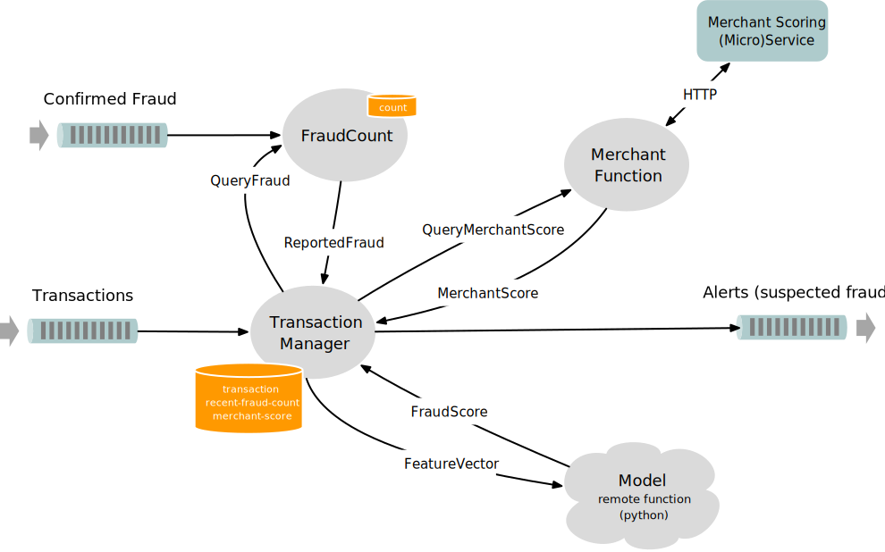
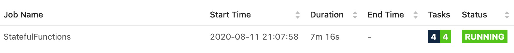

# Flink Stateful Functions Workshop 

## Setup Instructions

The following instructions guide you through the process of setting up a development environment for the purpose of developing,
debugging, and executing solutions for the workshop.

### Software Requirements

This workshop includes embedded stateful functions written in Java,
and a remote function implemented in Python.

The following software is required for running the code for this workshop:

* Git
* Docker

For the exercises described below you will also need a text editor for making (minor) modifications to the Python code, and `curl` for using the REST api.

### Clone and Prepare the Software

```bash
$ git clone https://github.com/ververica/flink-statefun-workshop.git
$ cd flink-statefun-workshop 
$ docker-compose build
```

If you haven’t done this before, at this point you’ll end up downloading all of the dependencies for this project and its Docker image.
This usually takes a few minutes, depending on the speed of your internet connection.

### Get it Running

```bash
$ docker-compose up
```

This should produce a lot of output, but after a minute or so you should start to see messages like this,
interspersed with occasional messages about checkpointing:

```
worker_1  | 2020-08-10 15:03:53,235 INFO  ...  - Suspected Fraud for account id 0x00DD98B2 at Peakhub
worker_1  | 2020-08-10 15:04:29,997 INFO  ...  - Suspected Fraud for account id 0x00F0AEFA at Overgram
```

<details>
<summary>
Can't use Docker? Click here for a workaround.
</summary>

Stateful Functions is designed with containers in mind, but it is possible to get this example running without Docker. You'll need a JDK (version 8 or 11), an IDE for Java development, and Python 3. 

For the Python part, you can do this:

```bash
$ cd statefun-workshop-python
$ pip install -r requirements.txt
$ gunicorn -b localhost:8888 -w 4 main:app
```

Leave the Python web server running, and then bring up Java-based Stateful Functions environment. There's a test you can run that does what's needed, and you can run this test in your IDE: see [RunnerTest](statefun-workshop-functions/src/test/java/com/ververica/statefun/workshop/harness/RunnerTest.java). You will need to first un-ignore this test, and just be aware that it will run continuously until you manually stop it. While it's running, look for output like this in the console:

```
Suspected Fraud for account id 0x001A0EB6 at Silverspan for 79533 USD
Suspected Fraud for account id 0x001B9152 at Conow for 91561 USD
Suspected Fraud for account id 0x0080418E at Corepass for 27660 USD
Suspected Fraud for account id 0x00CB1AF1 at Coreatlas for 53772 USD
```

</details>

## Architecture



This Stateful Functions application has two ingresses, one for Transactions (that need to be scored), and another for Transactions that have been confirmed by the customer as having been fraudulent. The egress handles Alert messages for Transactions that have been scored as being possibly fraudulent by the Model.

Incoming Transactions are routed to the TransactionManager, which sends them to both the MerchantFunction (for the relevant Merchant) and to the FraudCount function (for the relevant account). These functions send back feature data that gets packed into a FeatureVector that is then sent to the Model for scoring. The Model responds with a FraudScore that the TransactionManager uses to determine whether or not to create an Alert.

All ConfirmFraud messages are routed to the FraudCount function, which keeps one piece of per-account state: a count of Transactions that have been confirmed as fraudulent during the past 30 days. 

The TransactionManager keeps three items of per-transaction state, which are cleared once the transaction has been fully processed.

The MerchantFunction uses an asynchronously connected ProductionMerchantScoreService to provide the score for each Merchant. This mimics the HTTP connection you might have in a real-world application that uses a third-party service to provide enrichment data. The MerchantFunction handles timeouts and retries for the merchant scoring service.

The Model is running as a _Remote Function_ in a separate, stateless container, connected via HTTP.

## Exercises (Python)

The activities in this section can be done without recompiling the Java code or rebuilding the Docker image.

### Restart the Model

Since the Model is stateless, and running in its own container, we can redeploy and rescale it independently of the rest of the infrastructure.

We can't truly achieve a proper zero-downtime restart of the Python Model without a more elaborate setup, but can do a restart that merely causes the ongoing HTTP requests to be retried.

In one terminal window:

```bash
$ docker-compose up
```

and in another:

```bash
$ docker-compose rm -fsv python_model
$ docker-compose up python_model
```

### Change the Model

Now that you know how to redeploy the model without disrupting the pipeline, go ahead and modify and then redeploy the Model by editing `statefun-workshop-python/main.py`. Make a change that will be readily observable in the logging output, such as never scoring any Transactions for more than 1000 USD as fraudulent.

## Exercises (Operations)

### Explore the Flink WebUI

The Stateful Functions runtime is based on a [Apache Flink](https://flink.apache.org). If you browse to [http://localhost:8001](http://localhost:8001) this will bring up the Flink WebUI which you can use to explore the cluster running this application.

Start by clicking on this StatefulFunctions job in the list of running jobs:



This will then bring up a depiction of the Flink pipeline used for running Stateful Functions application, and some metrics about the activity in the Flink cluster.

Go ahead and explore! 

### Use the Flink CLI to do a Stateful Restart

Flink is playing the role of a database in this application: it is managing all of the persistent state. You may have noticed that regular checkpoints are being mentioned in the logs. In the case of a failure, Flink will restart from the most recent checkpoint.

Flink checkpoints are normally used only for automatic recovery in event of failure. To rescale or redeploy the cluster, you should take a _savepoint_ and use that savepoint when restarting.

The steps involved are:

1. Find the job ID
1. Take a savepoint
1. Stop the job
1. Restart the job with the savepoint

#### Finding the job ID

```bash
$ curl localhost:8001/jobs
{"jobs":[{"id":"3df90de7785eb1920b517d409e2fe475","status":"RUNNING"}]}
```

(You can also find the job ID in the WebUI.)

#### Taking a Savepoint

Be sure to replace `'jobid` with the job ID you found above.

```bash
$ curl -X POST localhost:8001/jobs/:jobid/savepoints -d '{"cancel-job": false}'
```

#### Stopping the Job

You can simply bring down all of the Docker containers. The savepoint includes all of the state needed to resume cleanly.

#### Restarting the Job with the Savepoint

You will find the savepoint in `./savepoint-dir`, e.g.,

```bash
$ ls savepoint-dir/
savepoint-3df90d-aa82d691740f
```

To bring up a brand new instance, using the state in this savepoint as the starting point, modify `./docker-compose.yml`. You will need to find a line that looks like this:

```
    #command: -s /savepoint-dir/savepoint-3df90d-aa82d691740f
```

Uncomment this line, and modify the savepoint path to point to your savepoint. 

Then restart the containers:

```bash
$ docker-compose up
```

If you look closely at the logs you will see the savepoint being mentioned, as in

```
master_1        | 2020-08-12 10:24:57,982 INFO  org.apache.flink.runtime.checkpoint.CheckpointCoordinator     - Starting job 53a0baf235b4f1db93157079b60f3719 from savepoint /savepoint-dir/savepoint-3df90d-aa82d691740f ()
```

<details>
<summary>
If you want to dig in deeper, click here to learn how.
</summary>

## Additional Explorations (Java)

To fully explore this application, you will also want to be able to modify and recompile the Java code, and to rebuild the Docker image. For this you will need:

* a JDK for Java 8 or Java 11 (a JRE is not sufficient; other versions of Java are not supported)
* Apache Maven 3.x
* an IDE for Java development, such as IntelliJ or Visual Studio Code

To do this, first modify `docker-compose.yml` by uncommenting the build lines for **both the master and worker services**, which specify 

```yaml
build: .
```
and then rebuild everything via

```bash
$ mvn install
$ docker-compose build
```

### Start with a Small Change

Start by making a small change, to verify that you have the basic tool chain working properly. Suggestions:

* Modify the `THRESHOLD` used by the `TransactionManager`.
* `FraudCount` maintains a rolling count of the `ConfirmFraud` events for each account for the past 30 days. Try changing that to 7 days.

### Add Another Feature to the FeatureVector

Note: Getting this to work involves modifying `statefun-workshop-protocol/src/main/protobuf/entities.proto` and regenerating the protobuf code (via `./generate-protobuf.sh`), which requires you have `protoc` installed. This will be easier to manage if you use the same version of `protoc` that we've used, namely version 3.7.1. 

A simple feature to add would be the merchant string that is already part of the `PersistedValue<Transaction>` stored by the `TransactionManager`. 

A more ambitious feature would be to send the time elapsed since the most recent `ConfirmFraud` for the same account, since this will involve creating a new `PersistedValue` to store the information.

</details>