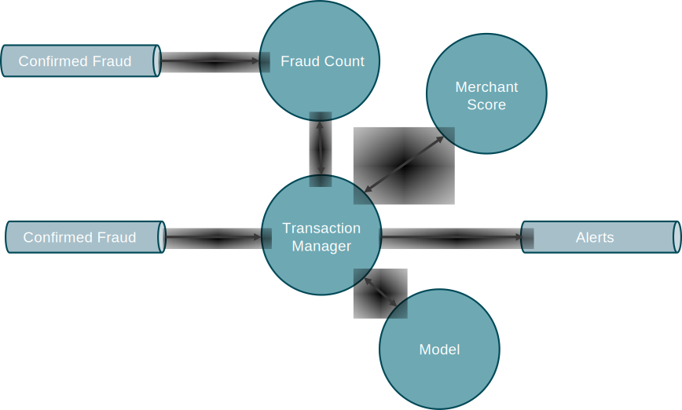

# Flink Stateful Functions Workshop 

## Setup Instructions

The following instructions guide you through the process of setting up a development environment for the purpose of developing,
debugging, and executing solutions for the workshop.

### Software Requirements

This workshop includes embedded stateful functions written in Java,
and a remote function implemented in Python.

The following software is required for building and running the code for this workshop:

* Git
* Docker

You will need a text editor for making (minor) modifications to the Python code.

If you want to be able to modify the parts of this workshop that are implemented in Java, you will also need:

* a JDK for Java 8 or Java 11 (a JRE is not sufficient; other versions of Java are not supported)
* Apache Maven 3.x
* an IDE for Java development, such as IntelliJ or Visual Studio Code

### Clone and Build the Software

```bash
$ git clone https://github.com/ververica/flink-statefun-workshop.git
$ cd flink-statefun-workshop 
$ mvn install
$ docker-compose build
```

If you haven’t done this before, at this point you’ll end up downloading all of the dependencies for this Flink project and the base docker image.
This usually takes a few minutes, depending on the speed of your internet connection.

### Get it Running

```bash
$ docker-compose up
```

This should produce a lot of output, but after a minute or so you should start to see messages like this,
interspersed with occasional messages about checkpointing:

```
worker_1  | 2020-08-10 15:03:53,235 INFO  ...  - Suspected Fraud for account id 0x00DD98B2 at Peakhub
worker_1  | 2020-08-10 15:04:29,997 INFO  ...  - Suspected Fraud for account id 0x00F0AEFA at Overgram
```

## Architecture



This Stateful Functions application has two ingresses, one for Transactions (that need to be scored), and another for Transactions that have been confirmed by the customer as having been fraudulent. The egress handles Alert messages for Transactions that have been scored as being possibly fraudulent by the Model.

Incoming Transactions are routed to the TransactionManager, which sends them to both the MerchantFunction (for the relevant Merchant) and to the FraudCount function (for the relevant account). These functions send back feature data that gets packed into a FeatureVector that is then sent to the Model for scoring. The Model responds with a FraudScore that the TransactionManager uses to determine whether or not to create an Alert.

All ConfirmFraud messages are routed to the FraudCount function, which keeps one piece of per-account state: a count of Transactions that have been confirmed as fraudulent during the past 30 days. 

The TransactionManager keeps three items of per-transaction state, which are cleared once the transaction has been fully processed.

The MerchantFunction uses an asynchronously connected ProductionMerchantScoreService to provide the score for each Merchant. This mimics the HTTP connection you might have in a real-world application that uses a third-party service to provide enrichment data. The MerchantFunction handles timeouts and retries for the merchant scoring service.

The Model is running as a _Remote Function_ in a separate, stateless container, connected via HTTP.

## Exercises and Suggested Explorations (Python)

The activities in this section can be done without recompiling the Java code or rebuilding the Docker image.

### Restart the Model

Since the Model is stateless, and running in its own container, we can re-deploy and re-scale it independently of the rest of the infrastructure.

We can't truly achieve a proper zero-downtime restart of the Python Model without a more elaborate setup, but can do a restart that merely causes the ongoing HTTP requests to be retried.

In one terminal window:

```bash
$ docker-compose up
```

and in another:

```bash
$ docker-compose rm -fsv python_model
$ docker-compose up python_model
```

### Change the Model

Now that you know how to redeploy the model without disrupting the pipeline, go ahead and modify and then redeploy the Model by editing `statefun-workshop-python/main.py`. Make a change that will be readily observable in the logging output, such as never scoring any Transactions for more than 1000 USD as fraudulent.

## Exercises and Suggested Explorations (Java)

For this section, you'll need to be able to recompile the Java code and rebuild the Docker image.

### Start with a Small Change

Start by making a small change, to verify that you have the entire tool chain working properly. Suggestions:

* Modify the `THRESHOLD` used by the `TransactionManager`.
* `FraudCount` maintains a rolling count of the `ConfirmFraud` events for each account for the past 30 days. Try changing that to 7 days.

### Re-implement FraudCount as a Remote Function (in Python)

### Add Another Feature to the FeatureVector

Note: Getting this to work will require modifying `statefun-workshop-protocol/src/main/protobuf/entities.proto` and re-generating the protobuf code (via `./generate-protobuf.sh`), which requires you have `protoc` installed. This will only be straightfoward if you use the same version of `protoc`, namely version 3.7.1.

A simple feature to add would be the merchant, which is already part of the `PersistedValue<Transaction>` stored by the `TransactionManager`. 

A more ambitious feature would be to send the time elapsed since the most recent `ConfirmFraud` for the same account.
